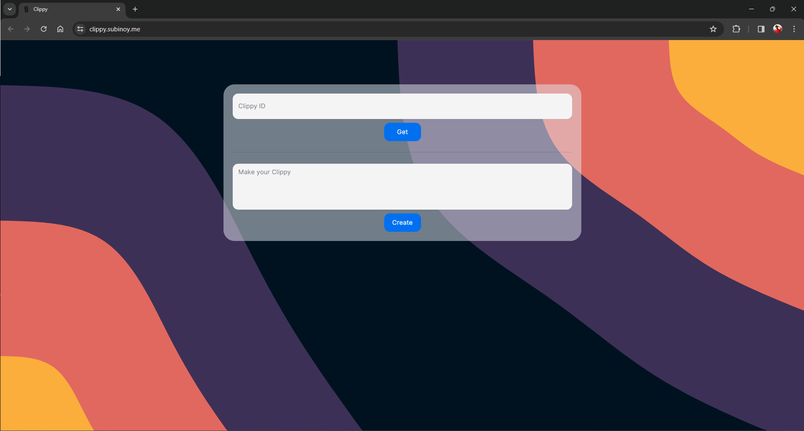
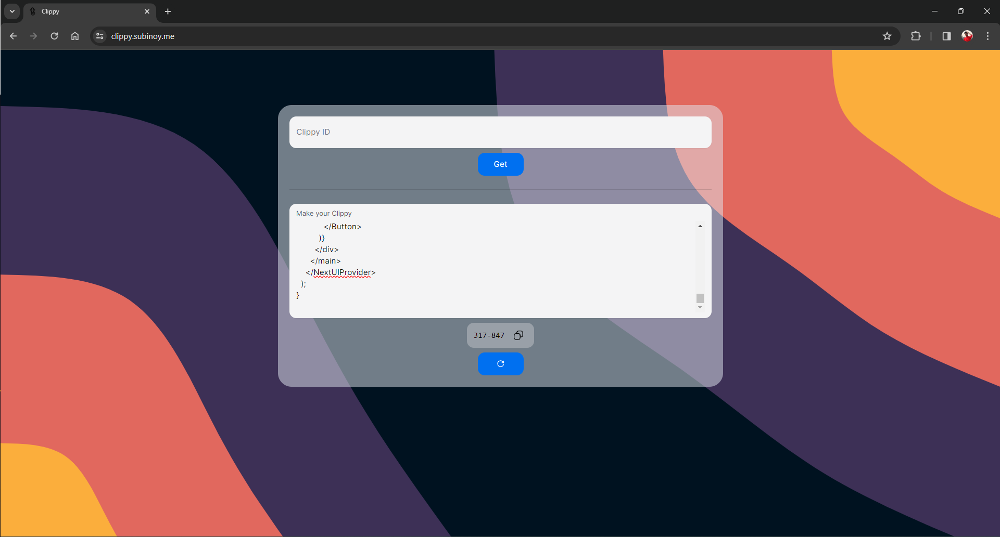

<center>

</center>
Welcome to Clippy, It is an online clipboard tool, to solve the age-old problem of coping and pasting a breeze, it also comes with features like file sharing. Clippy is made with Nextjs and uses MongoDB for storage.
<br>


## Table of Contents
- [Usage](#usage)
- [Screenshots](#screenshots)
- [Features](#features)
- [Setup Instructions](#setup-instructions)
  - [Installation](#installation)
  - [Set Up Environment Variables](#set-up-environment-variables)
  - [Run the Development Server](#run-the-development-server)
  - [Dockerfile](#dockerfile)
- [Contributing](#contributing)
  - [Contributing Guidelines](#contributing-guidelines)
- [Documentation](#documentation)
- [Join Us](#join-us)
- [Our Contributors](#our-contributors)

## Usage

Clippy is publically available and hosted on Vercel, you can access Clippy [here](https://clippy.subinoy.me/)

## Screenshots


_Homepage_


_Making a Clippy_

## Features

- Clipboard Management: Easily copy and paste text snippets with Clippy.
- File Sharing: Share files effortlessly using Clippy's file sharing feature.
- Secure Storage: Clippy uses MongoDB for secure storage of your clippings and files.

## Setup Instructions

To get started with this project, follow these steps:

### Installation

1.  Clone this repository:

```bash
git clone <link>
```

2.  Navigate to the Project Directory:

```bash
cd <filename>
```

### Install Dependencies:

Install the dependencies using your preferred package manager. For example, if you're using npm:

```bash
npm install
```

### Set Up Environment Variables:

This project requires environment variables for MongoDB connection. Create a .env file in the root directory of the project and add the following variables:

```plaintext
MONGODB_URI=<your_mongodb_uri>
MONGO_DB_NAME=<your_db_name>
MONGO_COLLECTION_NAME=<your_collection_name>
```

### Run the Development Server:

Once you have installed the dependencies and set up the environment variables, you can start the development server by running:

```bash
npm run dev
```

### Dockerfile:

Make sure you have `docker` & `docker compose` installed on the server / system. Both are installed by most docker utilities, including Docker Desktop and Rancher Desktop.

Note: `docker compose` without the hyphen is now the primary method of using docker-compose, per the Docker documentation.
we have a demo dockerfile
make sure u have a .dockerignore file in the root directory of the project.
add following lines into it

```.dockerignore
node_modules
```

now run the image with injecting the env variables into the docker itself

```docker
docker build -t clippy .
docker run -p 3000:3000 -e MONGODB_URI=<your_mongodb_uri> -e MONGO_DB_NAME=<your_db_name> -e MONGO_COLLECTION_NAME=<your_collection_name> clippy
```

## Contributing

If you'd like to contribute to this project, feel free to open an issue or submit a pull request. Contributions are welcome! , please follow these steps:

1.  Fork the repository.
2.  Create a new branch for your feature or bug fix.
3.  Make changes and commit them.
4.  Push your changes to your fork.
5.  Create a pull request.

